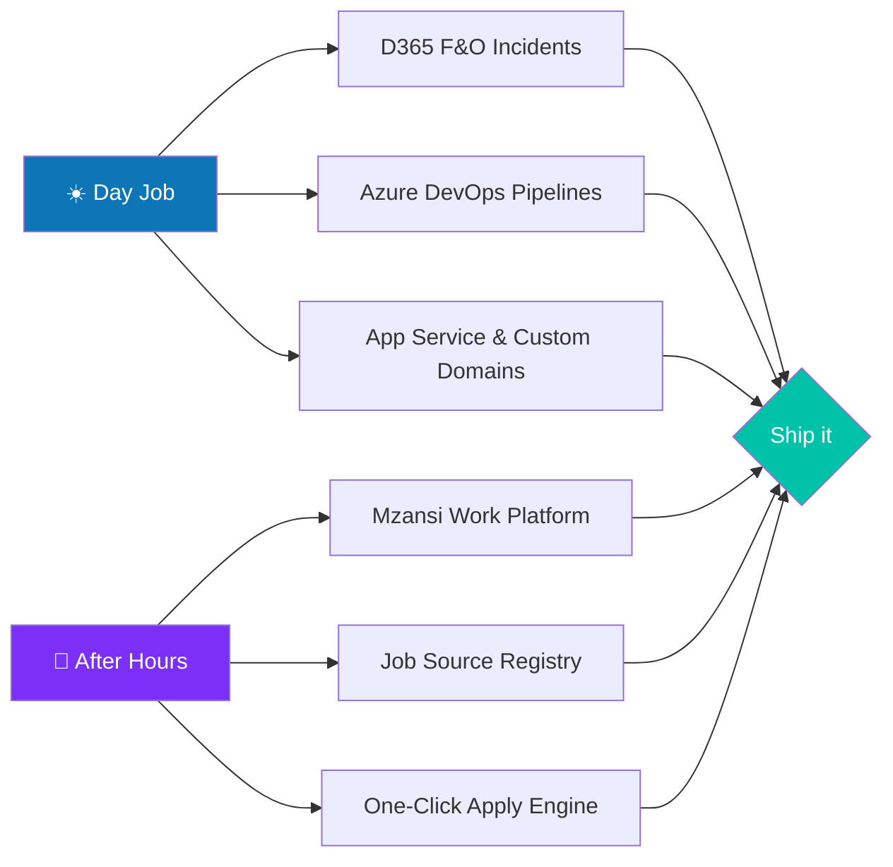

<!-- ═══════════════════════════════════════════════════════════════
     JackedUpProgrammer · GitHub Profile README
     Drop this file in a repo named "JackedUpProgrammer"
     ═══════════════════════════════════════════════════════════════ -->

<p align="center">
  
</p>

<p align="center">
  <a href="https://github.com/JackedUpProgrammer">
    
  </a>
</p>

<p align="center">
  
  
  
  
</p>

---

## `whoami`

```bash
$ johan --introduce --verbose
```

```yaml
name:       Johan Scheepers
role:       Technical Consultant (Dynamics 365 Finance & Operations)
location:   Brackenfell, Western Cape, South Africa 🇿🇦
education:  BSc Information Technology — North-West University (Pukke)
side_quest: Mzansi Work — a job platform for the people the internet forgot
philosophy: "If it takes three clicks and a spreadsheet, it should take one button."
coffee:     required
```

I'm the person clients call when the deployment failed at 22:00, the staging tables are 40 million rows deep, and everybody else has gone home. I spend my days deep inside **Dynamics 365 F&O**, **Azure**, and **Azure DevOps** — untangling release pipelines, chasing down production incidents, restoring databases, and translating "the system is broken" into an actual root cause.

Then I go home and build the thing I actually care about.

---

## 🌍 The Mission: **Mzansi Work**

> **Overlooked people. Overlooked opportunities.**

Most South African jobs never make it to LinkedIn or Indeed. The retail floor manager, the learnership candidate, the apprentice electrician, the call-centre agent keeping the country running — their vacancies live on municipal PDFs, forgotten career portals and WhatsApp groups.

**Mzansi Work** is my answer: a low-data, no-nonsense job discovery and application-tracking platform built for entry-level, first-time and overlooked South African job seekers.

<p align="center">
  
  
  
  
  
  
  
  
</p>

---

## 🧰 The Toolbox

<table>
  <tr>
    <td valign="top" width="50%">

**Enterprise & Cloud**


    </td>
    <td valign="top" width="50%">

**Code & Craft**


    </td>
  </tr>
</table>

---

## 📜 Certified & Stamped

<p align="center">
  <br/>
  <br/>
  
</p>

---

## 🔥 What I'm Doing Right Now



- 🔭 Building **Mzansi Work** — source registry, matching engine, and a one-click apply flow
- 🧪 Living in **UAT and Pre-Prod** so production never has a bad day
- ⚡ Automating anything that gets done twice
- 🌱 Going deeper on **Power Platform**, **Dataverse** and **AI-assisted development**
- 💬 Ask me about: D365 F&O troubleshooting, DMF staging cleanup, release pipelines, or why your custom domain keeps redirecting

---

## 📊 The Receipts

<p align="center">
  
  
</p>

<p align="center">
  
</p>

<p align="center">
  
</p>

---

## 🧭 Three Things Worth Knowing

> **1. I build for the people nobody builds for.**
> Enterprise software pays the bills. Mzansi Work pays the conscience.

> **2. I'd rather over-communicate than over-engineer.**
> Half of consulting is writing the email that stops the panic.

> **3. Afrikaans, English, and SQL.**
> Fluent in all three. Occasionally at the same time.

---

## 🤝 Let's Talk

<p align="center">
  <a href="mailto:jhl.scheepers229@gmail.com"></a>
  <a href="https://github.com/JackedUpProgrammer"></a>
  <a href="#"></a>
</p>

<p align="center">
  <em>"Overlooked people. Overlooked opportunities."</em>
</p>

<p align="center">
  
</p>
